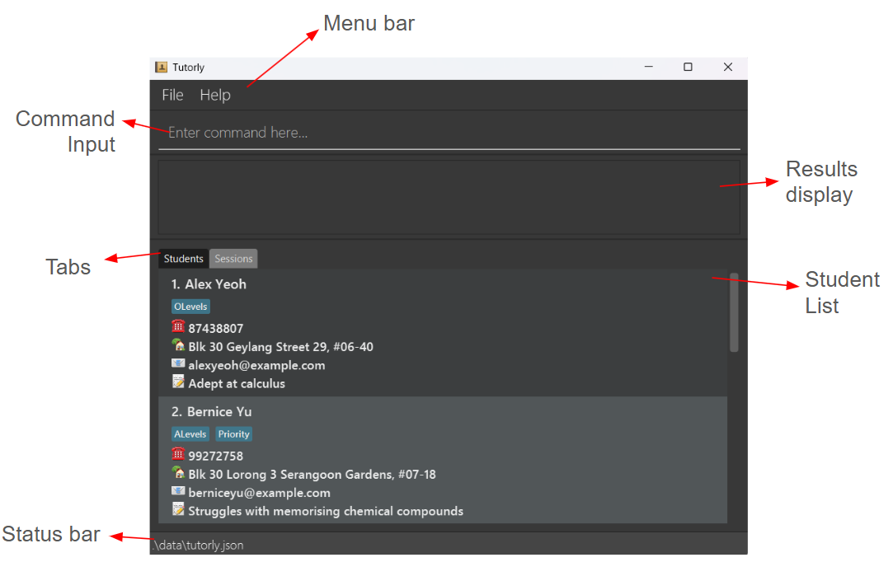
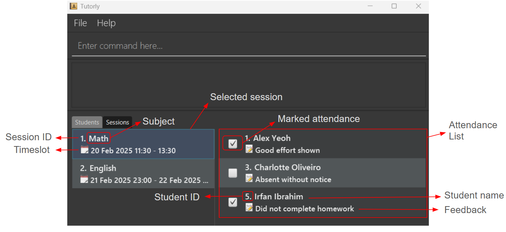
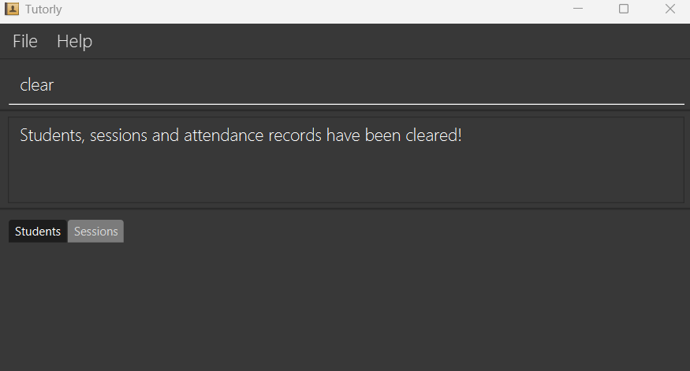
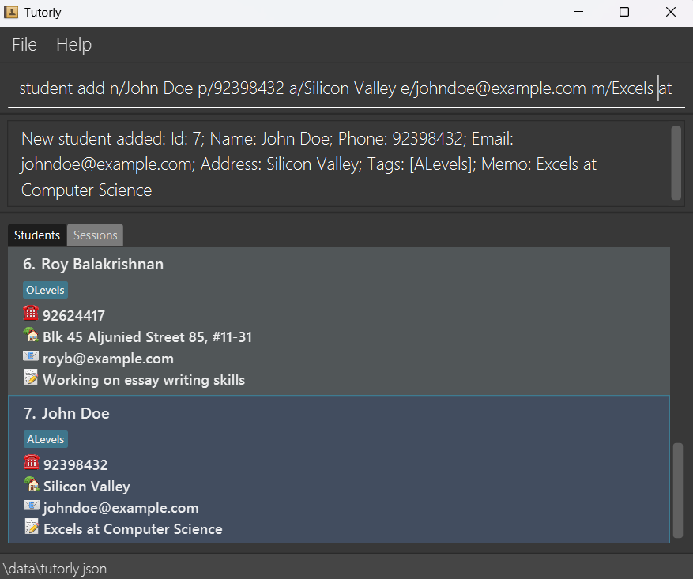
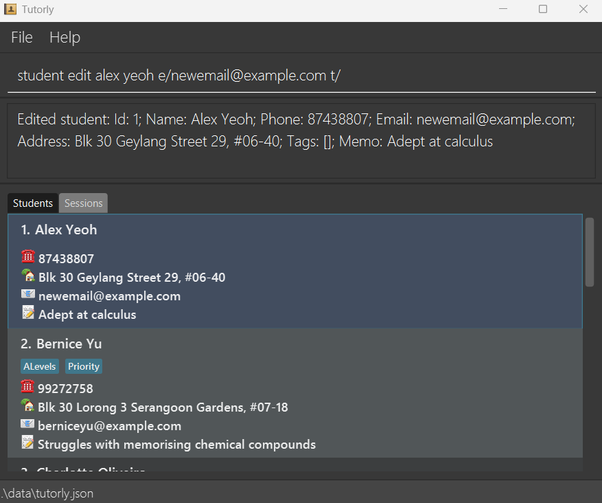
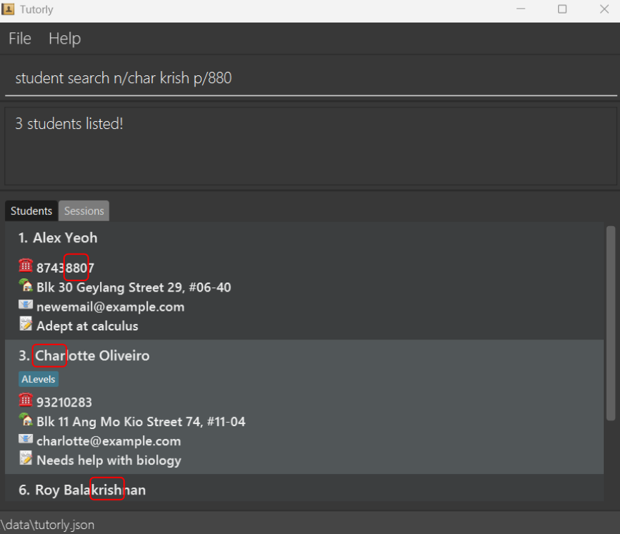
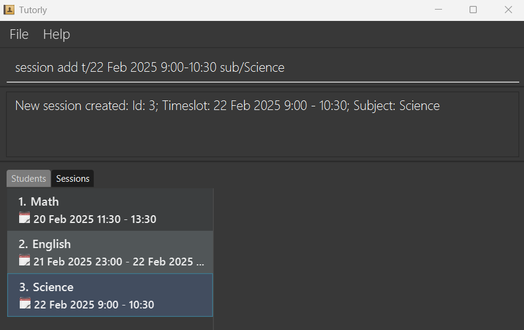
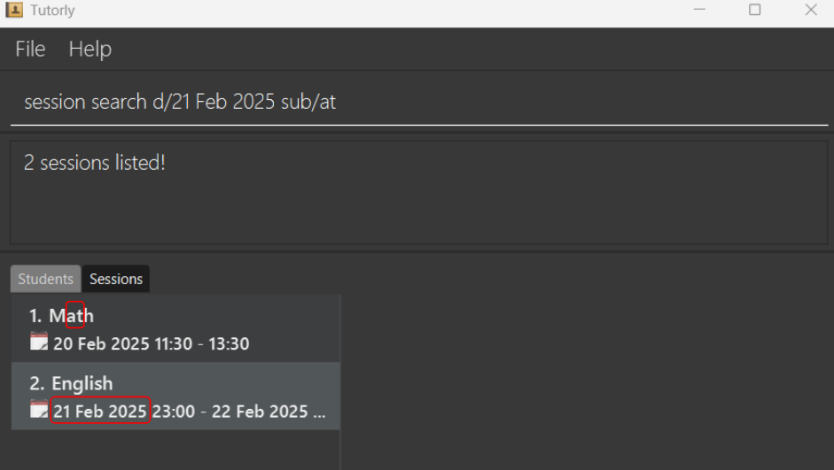
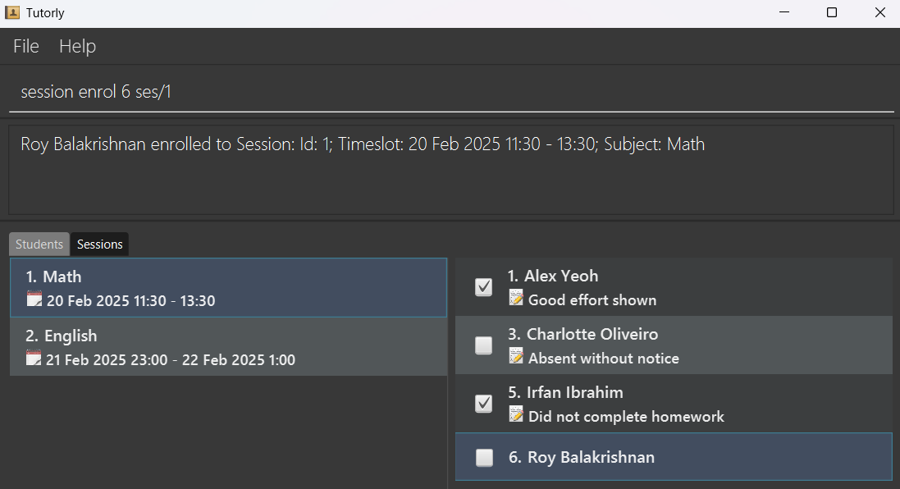
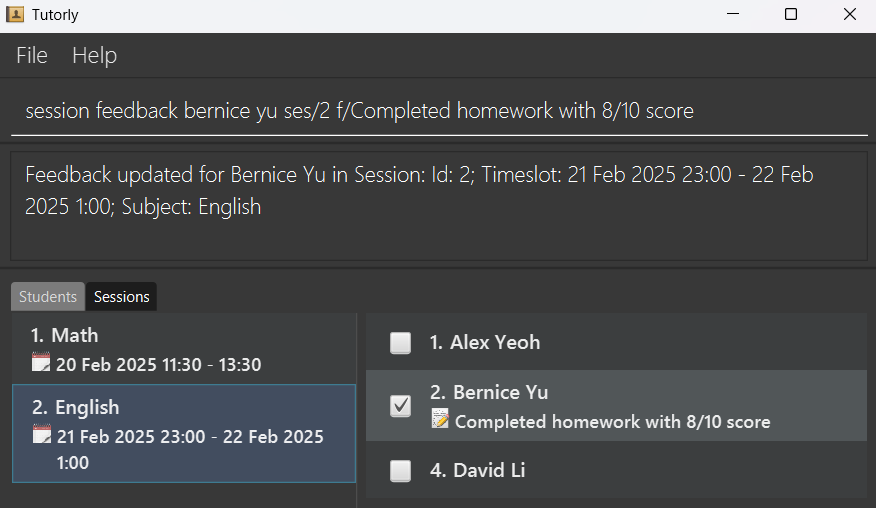

Tutorly is a desktop app designed for private tutors to **manage their student and lesson records efficiently**.
It combines the speed and precision of typing commands with the convenience of a visual interface.
If you prefer using your keyboard over clicking through menus, Tutorly allows you to complete student management tasks more quickly than traditional apps.

## Table of Contents
* Table of Contents
{:toc}

--------------------------------------------------------------------------------------------------------------------

## Quick start

1. **Install Java**: Ensure you have Java `17` or above installed in your Computer. You can download the correct [JDK](#glossary) for your [operating system](#glossary) using this [link](https://www.oracle.com/sg/java/technologies/downloads/). 
   **Mac users**: Ensure you have the precise JDK version prescribed [here](https://se-education.org/guides/tutorials/javaInstallationMac.html).

2. **Download Tutorly**: Get the latest [JAR](#glossary) file from [here](https://github.com/AY2425S2-CS2103T-T17-3/tp/releases/latest/download/tutorly.jar).

3. **Move the file**: Locate the downloaded `tutorly.jar` file and place it in a folder where you want to keep the app's data. This will be the app's _home folder_.

4. **Open a [command terminal](#glossary)** - This is a tool that lets you run commands on your computer:
   - On **Windows**: Press `Win + R`, type `cmd`, and press **Enter**.
   - On **Mac**: Open **Terminal** from the Applications > Utilities folder.
   - On **Linux**: Open **Terminal** from your applications menu.

5. **Navigate to the folder**: In the terminal, type `cd ` (with a space after). Then, **click and hold** the _home folder_, **drag** it into the terminal window and **release** it. Doing this will automatically insert the full path of the folder. Press **Enter**.

6. **Run Tutorly**: Type `java -jar tutorly.jar` and press **Enter**. This will start the application. A GUI similar to the below should appear in a few seconds, containing some sample data. 
   
7. **UI Layout**: Feel free to take a look at the following images for a better understanding of the layout!

### Students Tab

### Student Card

### Sessions Tab

### Execute a command

Type the command in the command box and press Enter to execute it. e.g. typing **`help`** and pressing Enter will open the help window. 
Some example commands you can try:

* `student list` : Lists all students.

* `student add n/John Doe p/98765432 e/johnd@example.com a/John street, block 123, #01-01` : Adds a student named `John Doe` to the app.

* `student delete 3` : Deletes the student with the ID 3.

* `session list` : List all sessions.

* `clear` : Deletes all students and sessions.

* `exit` : Exits the app.

Refer to the [Features](#features) below for details of each command.

[Back to top :arrow_up:](#table-of-contents)

--------------------------------------------------------------------------------------------------------------------

## Features

**:information_source: Notes about the command format:** 

* Words in `UPPER_CASE` are the [parameters](#parameter-summary) to be supplied by the user. 
  e.g. in `student add n/NAME`, `NAME` is a parameter which can be used as `student add n/John Doe`.

* [STUDENT_IDENTIFIER](#glossary) can either be the target student's ID, or their full name. Examples: `John Doe` or `2`.

* Parameters in square brackets are optional. 
  e.g `n/NAME [t/TAG]` can be used as `n/John Doe t/friend` or as `n/John Doe`.

* Items with `…`​ after them can be used multiple times including zero times. 
  e.g. `[t/TAG]…​` can be used as ` ` (i.e. 0 times), `t/friend`, `t/friend t/family` etc.

* Parameters can be in any order. 
  e.g. if the command specifies `n/NAME p/PHONE`, `p/PHONE n/NAME` is also acceptable.

* Extra parameters for commands that do not take in parameters ([general](#general-commands) commands, `student list` and `session list`) will be ignored. 
  e.g. if the command specifies `help 123` or `session list blah`, it will be interpreted as `help` and `session list`.

* If you are using a PDF version of this document, be careful when copying and pasting commands that span multiple lines as space characters surrounding line-breaks may be omitted when copied over to the application.

[Back to top :arrow_up:](#table-of-contents)

### General Commands

#### Viewing help: `help`

Shows a window containing the command summary with a link to this user guide.

Format: `help`

Help window:

#### Clearing all data: `clear`

Clears all students and sessions from the app.

Format: `clear`

Example output:

Running the [undo](#undoing-a-command-undo) command after `clear` restores all students and sessions to before the command was run.

#### Exiting the program: `exit`

Closes the Tutorly app.

Format: `exit`

#### Undoing a command: `undo`

Undoes the last successfully executed command that has updated the data.

Commands that update data and are thus undoable:
* The `clear` command.
* The `add`, `delete` and `edit` commands for [student](#student-management-student-action) and [session](#session-management-session-action).
* The `enrol`, `unenrol`, `mark`, `unmark` and `feedback` commands for [session](#session-management-session-action).

Format: `undo`

Examples:
* `session delete` followed by `undo` will undo the delete command by adding the session back.
* If the following commands were ran in order: `student edit`, `student add`, `student search`, `help`, running `undo` will undo the `student add` command.

:exclamation: **Caution:**
Commands that are not successfully executed due to errors will not be undone.

After closing and re-opening the app, all previous commands will be forgotten and running `undo` will not undo any previous commands before the app was closed.

[Back to top :arrow_up:](#table-of-contents)

--------------------------------------------------------------------------------------------------------------------

### Viewing tabs

:bulb: **Tip:**
The main window will automatically switch to the tab which shows the results of the command that has been executed.

Commands that updates the data will also clear any filters from previous `search` commands to view what has been updated. 
This [section](#undoing-a-command-undo) includes which commands will do so.

#### Viewing students tab: `student`

Shows the student tab in the main window.

Format: `student`

[Back to top :arrow_up:](#table-of-contents)

#### Viewing student card: `student STUDENT_IDENTIFIER`

Scrolls to the details of the student with the specified [STUDENT_IDENTIFIER](#glossary) in the window of the student tab.

Format: `student STUDENT_IDENTIFIER`

Examples:
* `student 1`
* `student John Doe`

Example output:

[Back to top :arrow_up:](#table-of-contents)

#### Viewing sessions tab: `session`

Shows the session tab in the main window.

Format: `session`

[Back to top :arrow_up:](#table-of-contents)

#### Viewing attendance for a session: `session SESSION_ID`

Shows the attendance of students for a given session.

Format: `session SESSION_ID`

Examples:
* `session 1`
* `session 5`

[Back to top :arrow_up:](#table-of-contents)

--------------------------------------------------------------------------------------------------------------------

### Student Management: `student ACTION`

The following commands all begin with `student` followed by an action word.

#### Adding a student: `add`

Adds a student to the app.

Format: `student add n/NAME [p/PHONE] [e/EMAIL] [a/ADDRESS] [m/MEMO] [t/TAG]…​`

:bulb: **Tip:**
A student can have any number of tags (including 0). Refer to [here](#parameter-summary) for the expected formats of the parameters.

Examples:
* `student add n/John Doe p/98765432 e/johnd@example.com a/John street, block 123, #01-01 m/loves Math`
* `student add n/Mary Jane t/olevels e/maryjane@example.com p/81234567 t/priority`

:exclamation: **Caution:**
Besides IDs, names are also used to uniquely identify students. Thus, duplicate students with the same name are not allowed.

Running `student add n/Mary Jane` when a student with the name `Mary Jane` already exists will show an error as it is considered a duplicate student.

Example output:

Running the [undo](#undoing-a-command-undo) command after `student add` **deletes** the newly added student.

[Back to top :arrow_up:](#table-of-contents)

#### Listing all students: `list`

Shows a list of all students.

Format: `student list`

[Back to top :arrow_up:](#table-of-contents)

#### Editing a student: `edit`

Edits an existing student with the specified [STUDENT_IDENTIFIER](#glossary).

Format: `student edit STUDENT_IDENTIFIER [n/NAME] [p/PHONE] [e/EMAIL] [a/ADDRESS] [m/MEMO] [t/TAG]…​`

* At least one of the optional [parameters](#parameter-summary) must be provided.
* Existing values will be updated to the input values.
* When editing tags, the existing tags of the person will be removed i.e adding of tags is not cumulative.
* You can remove all the person’s tags by typing `t/` without specifying any tags after it.

Examples:
* `student edit John Doe p/91234567 e/johndoe@example.com` Edits the phone number and email address of John Doe to be `91234567` and `johndoe@example.com` respectively.
* `student edit 2 n/Betsy Crower t/` Edits the name of the student with an ID of 2 to be `Betsy Crower` and clears all existing tags.

:exclamation: **Caution:**
Besides IDs, names are also used to uniquely identify students. Thus, duplicate students with the same name are not allowed.

Running `student edit 3 n/Betsy Crower` when another student named `Betsy Crower` already exists will show an error as it is considered a duplicate student.

Example output:

Running the [undo](#undoing-a-command-undo) command after `student edit` reverts the student's details back to before the edit was made.

[Back to top :arrow_up:](#table-of-contents)

#### Searching for students: `search`

Finds students whose names or phone numbers contain any of the given keywords, or is enrolled to a specific session.

Format: `student search [ses/SESSION_ID] [n/NAME_KEYWORDS] [p/PHONE_KEYWORDS]`

* The keywords are case-insensitive and order does not matter. e.g. `hans bo` will match `Bo Hans`
* Incomplete words will still be matched e.g. `Han` will match `Hans` or `8765` will match `91238765`
* Students matching at least one keyword **or** are enrolled to the session will be returned.

:exclamation: **Caution:**
`SESSION_ID` only accepts one valid number that corresponds with an existing session's ID.

This will be updated in future versions to allow the searching of multiple IDs.

Examples:
* `student search n/John p/9123 8765` returns `johnathan`, `John Doe` and other students with a phone number that contains `9123` or `8765`.
* `student search ses/3 n/alex david` returns `Alex Yeoh`, `David Li` and other students who attended session with the id 3.
* `student search` will simply return all students.

Example output (with matching keywords highlighted):

[Back to top :arrow_up:](#table-of-contents)

#### Deleting a student: `delete`

Deletes the student with the specified [STUDENT_IDENTIFIER](#glossary).

Format: `student delete STUDENT_IDENTIFIER`

Examples:
* `student delete 2` deletes the student with the ID of 2.
* `student delete John Doe` deletes the student with the name `John Doe`.

Running the [undo](#undoing-a-command-undo) command after `student delete` adds the deleted student back.

[Back to top :arrow_up:](#table-of-contents)

--------------------------------------------------------------------------------------------------------------------

### Session Management: `session ACTION`

The following commands all begin with `session` followed by an action word.

#### Adding a session: `add`

Adds a session to the app.

Format: `session add t/TIMESLOT sub/SUBJECT`

Refer to [here](#parameter-summary) for the expected format of the parameters.

Examples:
* `session add t/30 Mar 2025 11:30-13:30 sub/Math` adds a session with the subject `Math` on 30 March 2025 from 11.30am to 13.30pm.
* `session add t/30 Mar 2025 23:00-31 Mar 2025 01:00 sub/Eng` adds a session with the subject `Eng` which lasts 2 hours from 30 March 2025 11pm to 31 March 2025 1am.

Running the [undo](#undoing-a-command-undo) command after `session add` deletes the newly added session.

Example output:

[Back to top :arrow_up:](#table-of-contents)

#### Listing all sessions: `list`

Shows a list of all sessions.

Format: `session list`

[Back to top :arrow_up:](#table-of-contents)

#### Editing a session: `edit`

Edits an existing session.

Format: `session edit SESSION_ID [t/TIMESLOT] [sub/SUBJECT]`
* Edits the session with the `SESSION_ID`.
* At least one of the optional [parameters](#parameter-summary) must be provided.
* Existing values will be updated to the input values.

Examples:
*  `session edit 3 t/11 Apr 2025 11:30-13:30` Edits the date of the session with the ID 3 to be on 11 April 2025 from 11.30am to 1.30pm.
*  `session edit 2 t/20 June 2025 23:00-21 June 2025 01:00 sub/Math` Edits the date and subject of the session with the ID 2 to last from 20 June 2025 11pm to 21 June 2025 1am with the subject `Math`.

Running the [undo](#undoing-a-command-undo) command after `session edit` reverts the session's details back to before the edit was made.

[Back to top :arrow_up:](#table-of-contents)

#### Searching for sessions: `search`

Finds sessions on a particular date or on a subject which matches any of the given keywords.

Format: `session search [d/DATE] [sub/SUBJECT_KEYWORDS]`

* The keywords and case-insensitive and order does not matter. e.g. `math eng` will match `Eng Math`
* Incomplete words will still be matched e.g. `Mat` will match `Math`
* Sessions whose timeslots contain the given date or have a subject that match at least one keyword will be returned.

Examples:
* `session search d/22 May 2025` returns sessions with timeslots that include 22 May 2025.
* `session search sub/Math d/11 Jun 2025` returns sessions with subjects `Math`, `Mathematics` and sessions with timeslots that include 11 June 2025. 
* `session search` will simply return all sessions.

Example output (with matching keywords and date highlighted):

[Back to top :arrow_up:](#table-of-contents)

#### Deleting a session: `delete`

Deletes the session with the given ID.

Format: `session delete SESSION_ID`

Examples:
* `session delete 2` deletes the session with the ID of 2.

Running the [undo](#undoing-a-command-undo) command after `session delete` adds the deleted session back.

[Back to top :arrow_up:](#table-of-contents)

#### Enrolling a student to a session: `enrol`

Enrols a student with the specified [STUDENT_IDENTIFIER](#glossary) to a specific session.

Format: `session enrol STUDENT_IDENTIFIER ses/SESSION_ID`

* The attendance for the student to the session upon enrolment is marked as absent by default.

Examples:
* `session enrol 2 ses/3` enrols a student with an ID of 2 to attend a session with an ID of 3.
* `session enrol John Doe ses/4` enrols a student with the name `John Doe` to attend a session with an ID of 4.

Example output:

Running the [undo](#undoing-a-command-undo) command after `session enrol` will unenrol the student from the session.

[Back to top :arrow_up:](#table-of-contents)

#### Unenrolling a student from a session: `unenrol`

Unenrols a student with the specified [STUDENT_IDENTIFIER](#glossary) from a session.

Format: `session unenrol STUDENT_IDENTIFIER ses/SESSION_ID`

Examples:
* `session unenrol 2 ses/3` unenrols a student with an ID of 2 from a session with an ID of 3.
* `session unenrol John Doe ses/4` unenrols a student with the name `John Doe` from a session with an ID of 4.

Running the [undo](#undoing-a-command-undo) command after `session unenrol` will enrol the student back into the session.

[Back to top :arrow_up:](#table-of-contents)

#### Marking attendance: `mark`

Marks the attendance of a student with the specified [STUDENT_IDENTIFIER](#glossary) for a session.

Format: `session mark STUDENT_IDENTIFIER ses/SESSION_ID`

Examples:
* `session mark 2 ses/3` marks the attendance for the student with an ID of 2 for a session with an ID of 3 as present.
* `session mark John Doe ses/4` marks the attendance for a student with the name `John Doe` for a session with an ID of 4 as present.

Running the [undo](#undoing-a-command-undo) command after `session mark` will unmark the student's attendance in the session.

:bulb: **Tip:**
You can also click on the checkbox next to a student's name in a session's attendance list to toggle the marking of attendance.

[Back to top :arrow_up:](#table-of-contents)

#### Unmarking attendance: `unmark`

Unmarks the attendance of a student with the specified [STUDENT_IDENTIFIER](#glossary) for a session.

Format: `session unmark STUDENT_IDENTIFIER ses/SESSION_ID`

Examples:
* `session unmark 2 ses/3` unmarks the attendance for the student with an ID of 2 for a session with an ID of 3.
* `session unmark John Doe ses/4` unmarks the attendance for a student with the name `John Doe` for a session with an ID of 4.

Running the [undo](#undoing-a-command-undo) command after `session unmark` will mark the student's attendance in the session.

:bulb: **Tip:**
You can also click on the checkbox next to a student's name in a session's attendance list to toggle the marking of attendance.

[Back to top :arrow_up:](#table-of-contents)

#### Adding or updating feedback: `feedback`

Adds or updates the feedback for a student with the specified [STUDENT_IDENTIFIER](#glossary) in a session.

Format: `session feedback STUDENT_IDENTIFIER ses/SESSION_ID f/FEEDBACK`

* If no feedback exists, a new feedback will be added for the student in the session.
* If a feedback already exists, the old feedback will be overwritten, i.e. Only one feedback is allowed per student per session.
* You can remove a previously set feedback by typing f/ without specifying any feedback after it.
* Feedback for a student is viewable in the attendance list of a session.

Examples:
* `session feedback 2 ses/3 f/Good Job!` updates the feedback `Good Job!` for the student with an ID of 2 for a session with an ID of 3.
* `session feedback John Doe ses/4 f/Sick leave` updates the feedback `Sick leave` for a student with the name `John Doe` for a session with an ID of 4.
* `session feedback Betsy Crower ses/4 f/` clears the feedback for a student with the name `Betsy Crower` for a session with an ID of 4.

Example output:

Running the [undo](#undoing-a-command-undo) command after `session feedback` reverts the feedback back to before the command was run.

[Back to top :arrow_up:](#table-of-contents)

--------------------------------------------------------------------------------------------------------------------

### Saving the data

Tutorly data are saved in the hard disk automatically after any command that changes the data. There is no need to save manually.

### Editing the data file

Tutorly data are saved automatically as a JSON file `[home_folder]/data/tutorly.json`. Advanced users are welcome to update data directly by editing that data file.

:exclamation: **Caution:**
If your changes to the data file makes its format invalid, Tutorly will discard all data and start with an empty data file at the next run. Hence, it is recommended to take a backup of the file before editing it. 
Furthermore, certain edits can cause the Tutorly to behave in unexpected ways (e.g., if a value entered is outside of the acceptable range). Therefore, edit the data file only if you are confident that you can update it correctly.

[Back to top :arrow_up:](#table-of-contents)

--------------------------------------------------------------------------------------------------------------------

## FAQ

**Q**: How do I transfer my data to another Computer? 
**A**: Install the app in the other computer and overwrite the empty data file it creates with the file that contains the data of your previous Tutorly _home folder_.

**Q**: What is the difference between the `student list` and `student` commands? 
**A**: The `student list` command will list all students in Tutorly. The `student` command simply switches the active tab to students and preserves results from any previous `student search` commands. The same applies to `session` and `session list`. 

**Q**: What is the difference between the `memo` and `feedback`? 
**A**: `Memo` is a short note you can add on to a student's details, while `feedback` is specifically for a student's performance in a particular session.

**Q**: How should I fill in the `STUDENT_IDENTIFIER` parameter? 
**A**: The `STUDENT_IDENTIFIER` can either be the student's ID or their full name, both of which are viewable from the UI.

[Back to top :arrow_up:](#table-of-contents)

--------------------------------------------------------------------------------------------------------------------

## Known issues

1. **When using multiple screens**, if you move the application to a secondary screen, and later switch to using only the primary screen, the GUI will open off-screen. The remedy is to delete the `preferences.json` file created by the application before running the application again.
2. **If you minimize the Help Window** and then run the `help` command (or use the `Help` menu, or the keyboard shortcut `F1`) again, the original Help Window will remain minimized, and no new Help Window will appear. The remedy is to manually restore the minimized Help Window.

[Back to top :arrow_up:](#table-of-contents)

--------------------------------------------------------------------------------------------------------------------

## Parameter summary

| Parameter | Constraint                                                                              | Length             | Example                          |
|-----------|-----------------------------------------------------------------------------------------|--------------------|----------------------------------|
| ADDRESS   | -                                                                                       | Max: 255           | Blk 30 Geylang Street 29, #06-40 |
| DATE      | Format: `dd MMM yyyy`                                                                   | -                  | 11 Apr 2025                      |
| EMAIL     | Format: `local-part@domain`                                                             | Max: 254           | hello@tutorly.com                |
| FEEDBACK  | -                                                                                       | Max: 200           | Did not complete homework        |
| MEMO      | -                                                                                       | Max: 255           | Adept at calculus                |
| NAME      | Only contain letters, numbers, spaces, and these special characters: `()@*-+=:;'<>,?/.` | Max: 255           | John Doe                         |
| PHONE     | Only contain numbers, spaces, hyphens, and an optional country code prefix              | Min: 3 Max: 20 | +65 98765432                     |
| SUBJECT   | -                                                                                       | Max: 20            | Mathematics                      |
| TAG       | -                                                                                       | Max: 20            | A-Levels                         |
| TIMESLOT  | Format: `dd MMM yyyy HH:mm-HH:mm` or `dd MMM yyyy HH:mm-dd MMM yyyy HH:mm`              | -                  | 11 Apr 2025 16:00-18:00          |

[Back to top :arrow_up:](#table-of-contents)

--------------------------------------------------------------------------------------------------------------------

## Command summary

| Context | Action                                                                  | Format                                                                                        | Examples                                               |
|---------|-------------------------------------------------------------------------|-----------------------------------------------------------------------------------------------|--------------------------------------------------------|
| General | [Help](#viewing-help-help)                                              | `help`                                                                                        | -                                                      |
|         | [Clear data](#clearing-all-data-clear)                                  | `clear`                                                                                       | -                                                      |
|         | [Exit](#exiting-the-program-exit)                                       | `exit`                                                                                        | -                                                      |
|         | [Undo command](#undoing-a-command-undo)                                 | `undo`                                                                                        | -                                                      |
| Tab     | [Show students tab](#viewing-students-tab-student)                      | `student`                                                                                     | -                                                      |
| Tab     | [Show student card](#viewing-student-card-student-student_identifier)   | `student STUDENT_IDENTIFIER`                                                                  | `student 1` or `student John Doe`                      |
|         | [Show session tab](#viewing-sessions-tab-session)                       | `session`                                                                                     | -                                                      |
|         | [Show attendance](#viewing-attendance-for-a-session-session-session_id) | `session ID`                                                                                  | `session 4`                                            |
| Student | [Add](#adding-a-student-add)                                            | `student add n/NAME [p/PHONE] [e/EMAIL] [a/ADDRESS] [m/MEMO] [t/TAG]…​`                       | `student add n/John Doe p/98765432`                    |
|         | [List](#listing-all-students-list)                                      | `student list`                                                                                | -                                                      |
|         | [Edit](#editing-a-student-edit)                                         | `student edit STUDENT_IDENTIFIER [n/NAME] [p/PHONE] [e/EMAIL] [a/ADDRESS] [m/MEMO] [t/TAG]…​` | `student edit 2 n/James Lee p/91234567`                |
|         | [Search](#searching-for-students-search)                                | `student search [ses/SESSION_ID] [n/NAME_KEYWORDS] [p/PHONE_KEYWORDS]`                        | `student search n/alex dav p/9123 8765`                |
|         | [Delete](#deleting-a-student-delete)                                    | `student delete STUDENT_IDENTIFIER`                                                           | `student delete 3`                                     |
| Session | [Add](#adding-a-session-add)                                            | `session add t/TIMESLOT sub/SUBJECT`                                                          | `session add t/30 Mar 2025 11:30-13:30 sub/Math`       |
|         | [List](#listing-all-sessions-list)                                      | `session list`                                                                                | -                                                      |
|         | [Edit](#editing-a-session-edit)                                         | `session edit SESSION_ID [t/TIMESLOT] [sub/SUBJECT]`                                          | `session edit 2 t/11 Jun 2025 11:30-13:30 sub/English` |
|         | [Search](#searching-for-sessions-search)                                | `session search [d/DATE] [sub/SUBJECT_KEYWORDS]`                                              | `session search d/2025-04-15 sub/Math Eng`             |
|         | [Delete](#deleting-a-session-delete)                                    | `session delete SESSION_ID`                                                                   | `session delete 1`                                     |
|         | [Enrol student](#enrolling-a-student-to-a-session-enrol)                | `session enrol STUDENT_IDENTIFIER ses/SESSION_ID`                                             | `session enrol 4 ses/3`                                |
|         | [Unenrol student](#unenrolling-a-student-from-a-session-unenrol)        | `session unenrol STUDENT_IDENTIFIER ses/SESSION_ID`                                           | `session unenrol 4 ses/3`                              |
|         | [Mark attendance](#marking-attendance-mark)                             | `session mark STUDENT_IDENTIFIER ses/SESSION_ID`                                              | `session mark John Doe ses/2`                          |
|         | [Unmark attendance](#unmarking-attendance-unmark)                       | `session unmark STUDENT_IDENTIFIER ses/SESSION_ID`                                            | `session unmark 3 ses/2`                               |
|         | [Add or Update feedback](#adding-or-updating-feedback-feedback)         | `session feedback STUDENT_IDENTIFIER ses/SESSION_ID f/FEEDBACK`                               | `session feedback 3 ses/2 f/Good Job!`                 |

[Back to top :arrow_up:](#table-of-contents)

--------------------------------------------------------------------------------------------------------------------

## Glossary

| Term               | Definition                                                                                                                                                                    |
|--------------------|-------------------------------------------------------------------------------------------------------------------------------------------------------------------------------|
| Command Terminal   | A tool on a computer where you type instructions to make the computer perform tasks.                                                                                          |
| Home folder        | The folder which contains the `tutorly.jar` file and data folder.                                                                                                             |
| JAR                | Java Archive file: A package that bundles a Java program and all its necessary parts into a single file, making it easier to share and run.                                   |
| JDK                | Java Development Kit: A software package that provides everything needed to create and run Java programs.                                                                     |
| Operating System   | An operating system is the main software that manages a computer’s hardware and allows you to run applications. Some examples include `Windows`, `Mac` and `Linux`.           |
| Parameters         | These are placeholders in a command that users replace with specific information to customize the command's action. They are usually prefixed with letters like `n/` or `p/`. |
| STUDENT_IDENTIFIER | A parameter used to identify a student. It can either be the student's ID, or their full name.                                                                                |

[Back to top :arrow_up:](#table-of-contents)

## Coming soon

Planned features that will be added in the coming versions.

1. A `redo` command in case you want to undo your `undo`.
2. `student search` via other fields including **tags**.
3. `class` management commands that handles adding of **multiple** sessions and **mass** enrolling/marking of attendance for students.
4. Viewing sessions each student is enrolled in via the `students` tab.

[Back to top :arrow_up:](#table-of-contents)

--------------------------------------------------------------------------------------------------------------------
